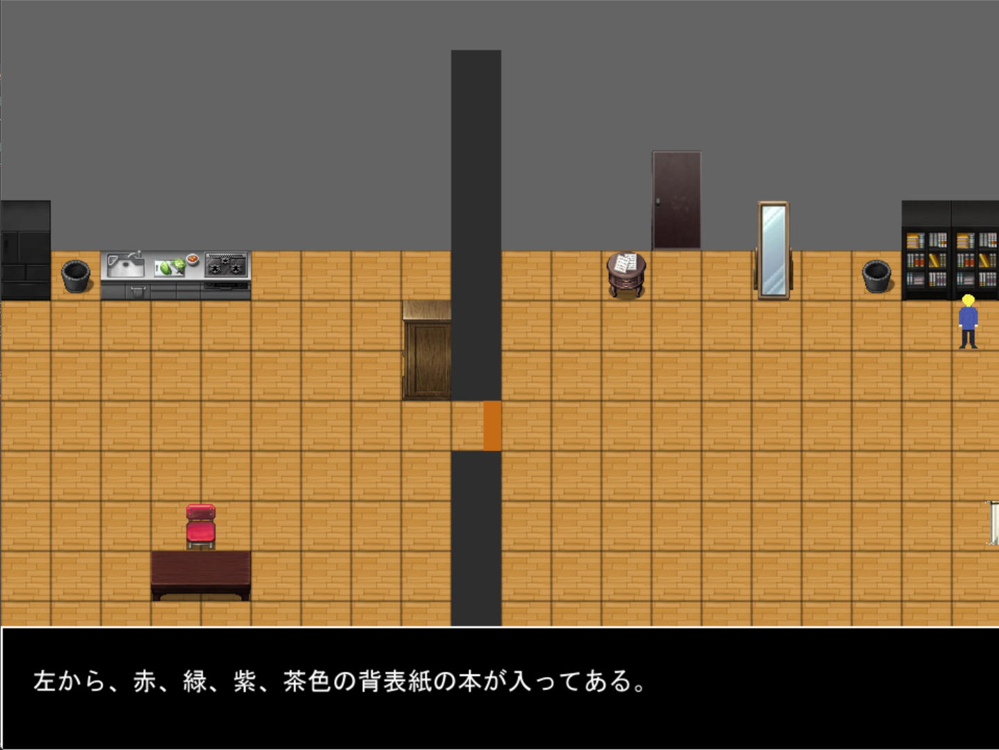
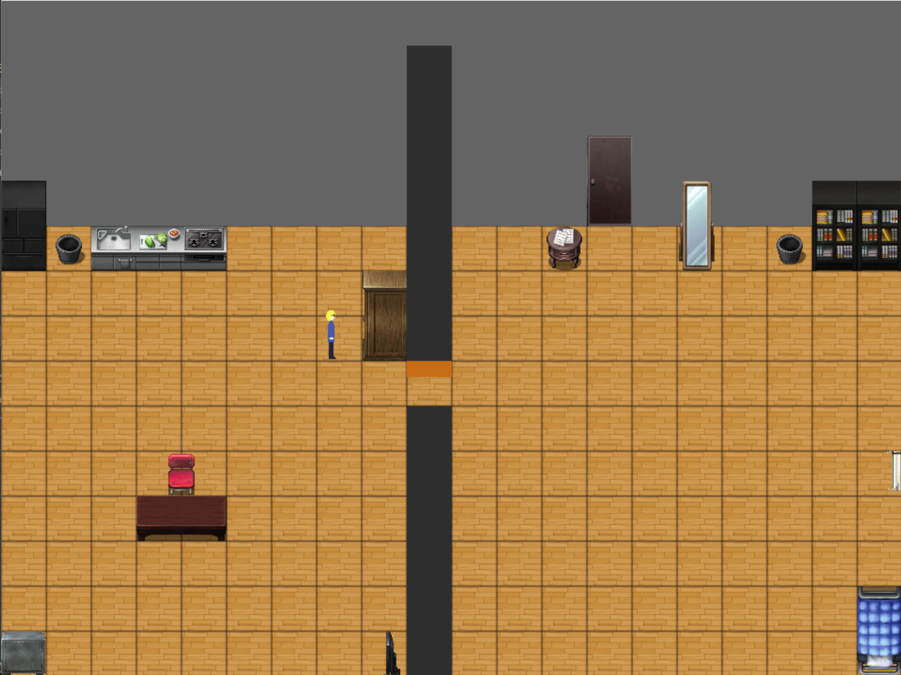

# 家に帰りたい。

---

## あらすじ

目が覚めると、そこは見覚えのない家の中だった。
家の中には自分の好みのものばかり、気味の悪さを感じながらも家の中を探索していく。
主人公は無事にこの家から脱出することができるのだろうか、また、犯人の意図は一体...？

---

## 操作方法

- WASD キーで移動
- E キーで調べる
- SPACE キーでゲーム開始、次のテキストへ
- Q キーで所持品の確認

---

## プレイ方法

リリースにある MainGameScript.exe をダウンロードしてください。

---

## 制作について

このゲームは python の pygame で制作しています。 
ゲーム中のイラストは以下のものを使用させていただきました。また、姿見、クローゼット、金庫、カレンダーは Ai で出力したものを、中間の壁と扉は私が描いたものを使用しています。 
コミュ将 https://twitter.com/com_sho_sozai - [キャラクターの部屋](https://graphic.fungamemake.com/archives/2387)

---

## 制作期間

2025/12/17 ~ 2026/1/3

---

## ゲーム写真

---

## 詰まった方へ、答えです

### 

区切り扉の鍵の場所

左の本棚を調べてみてください。

### 

コンロの光っているものの取り方

右の部屋をくまなく調べてみてください。

### 

小箱の番号

何かの日付です。どこに書かれているのでしょうか。

### 

金庫の番号の順番

右の部屋をくまなく調べてみてください。どこか一か所だけメッセージが変わっている場所があります。

---

## ネタバレ注意！！ エンディングについて

ゲームをプレイしていただき、ありがとうございます。作者の nato です。
早速本題のエンディングについてなのですが、見ていただいた方はお察しかもしれませんが主人公は認知症を患っており、その影響で自分の家という認識がなく、脱出しようとしています。
主人公の反応などの不気味さを感じていただけたなら幸いです。

---

## 裏話

本当はもっと大きな家にしたかったのですが(二部屋の家はリアリティがなさすぎる)、想像力が足りなかったので二部屋になりました。
実は、初めて謎解き脱出ゲームというものを作ってみたのですが、謎解きを考えることがとてもむずかしく何回も止まってしまいました。正直謎解きは単純すぎたかなと思っています。でも、主人公が認知症で自分の家から脱出するという発想は尖っていていいと思っています。
